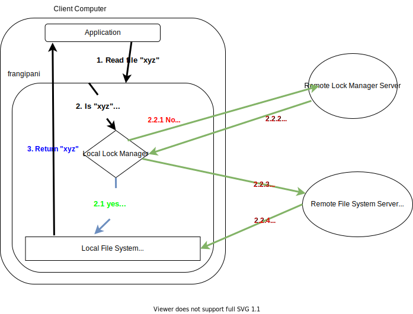

# Explore Project: KV Raft Based On Frangipani

The idea of this project originated from the testing requirements in lab 3 - KV Raft.

## Background: The Problem In Lab 3

### Requirements In KVRaft Tests: Performance & Linearizability

Doubtlessly, the KV Raft should provide **linearizable** `Get`, `Put` and `Append` APIs to clients; however, one test requires the KV Raft to achieve relatively high performance, namely **at least three commands from the same client per heartbeat** (assume the heartbeat period is 100ms). 

### The Deficiency Of The Naïve Implementation

Unfortunately, naïve implementation, which achieved linearizability by waiting for the previous command to complete before issuing the next command, can only carry one command from each client per heartbeat, which failed the `SpeedTest`. 

The following pseudo-code illustrates the client-side and server-side implementations:

```go
func (ck *Clerk) Put(key string, value string) {
  for {
    call leader.Put with (key, value)
    if reply.Err == OK {
      return
    }
  }
}
```

```go
func (kv *KVServer) Put(args *PutArgs, reply *PutReply) {
  kv.mu.Lock()
  defer kv.mu.Unlock()
  kv.rf.Start(Op{args.key, args.value, args.clerkID, args.SeqNo})
  for command not applied {
    kv.condReply.Wait()
  }
  reply = OK
}
```

#### One Potential Amendment To The Naïve Implementation: Increase Heartbeat Rate

In the Raft lab, I set the leader to send heartbeats every 100ms. However, if the leader sends heartbeats whenever it receives a new command, which means sending heartbeats every 10ms in the lab, the performance can be improved by 10 times, which is enough to pass the `SpeedTest`.

## The Solution: Frangipani

You can refer to the paper [here](http://nil.lcs.mit.edu/6.824/2022/papers/thekkath-frangipani.pdf).

### Introduction

Frangipani is a distributed storage system implementing **cache consistency**. It was invented for researchers who usually work on their own papers but sometimes need others to cooperate on their papers.

#### Mechanism & Example

The basic idea is that whenever a client wants to read or write a file, it must obtain a corresponding lock (*shared lock* or *exclusive lock*) with a lease. The following picture gives an example of an app wanting to read from a frangipani-based FS:



#### Benefits

1. **Fast.** Because all write operations are performed locally, it can avoid network delays. In [the real test](#speed-testone-client-ideal-network-no-crash), the performance is **1000 times** faster than naïve implementation, in which all write operations go through the leader and the client has to wait for Raft to replicate them.
2. **Strong consistency (linearizability)**. Because clients MUST acquire locks before proceeding, no inconsistent state can be observed by other clients.

#### Drawbacks

If several clients operate on the same file, the lock will circulate among the clients, making write operations less efficient.

### Implementations In KV Raft

I will show the pseudo-code.

#### Client side

```go
type Clerk struct {
  servers []*RPCCallEnd
  mu      sync.Mutex
  cond    *sync.Cond
  myID    int64
  
  kvMap   map[string]string
  lm      LockManagerClient
  seqNo   int
}

func MakeClerk() *Clerk {
  clerk := &Clerk{}
  go clerk.renewer()
  return clerk
}

func (ck *Clerk) renewer() {
  for {
    time.Sleep(100ms)
    args := RenewLeaseArgs{ck.lm.GetLockedKeySet(), ck.myID}
    reply := RenewLeaseReply{}
    ck.servers[leaderID].Call("KVServer.RenewLease"), &args, &reply)
    ck.processResults(reply)
  }
}

func (ck *Clerk) processResults(reply RenewLeaseReply) {
  defer ck.cond.Broadcast()
  kvsToFlush = make(map[string]string)
  for issuedTime := range reply.issuedTimes {
    if issuedTime.IsZero { // not grant
      kvsToFlush[key] = ck.kvMap[key]
    } else {
      ck.lm.RenewLock(key, issuedTime)
    }
  }
  flush `kvsToFlush` to the server
  unlock the keys in `kvsToFlush`
}

func (ck *Clerk) Get(key string) string {
  for ck.lm.Locked(key) {
    if !ck.lm.LockExpired(key) {
      return ck.kvMap[key]
    } else {
      // Wait for renewer to renew the lock
      ck.cond.Wait()
    }
  }
  // else, I do not hold the lock
  get the lock from the remote server
  read the kv pair from the remote server into ck.kvMap
  return ck.kvMap[key]
}

func (ck *Clerk) PutAppend(key, value, op string) {
  for ck.lm.Locked(key) {
    if !ck.lm.LockExpired(key) {
      Put/Append to the key
    } else {
      // Wait for renewer to renew the lock
      ck.cond.Wait()
    }
  }
  // else, I do not hold the lock
  get the lock from the remote server
  read the kv pair from the remote server into ck.kvMap
  Put/Append to the key
}
```

#### Server Side

```go
func (kv *KVServer) Get(args, reply) {
  reply if I'm not the leader
  
  if args.key is locked by args.clerkID {
    reply.Value = kv.kvMap[args.Key]
    reply ErrDup, the client can proceed any operations
  }
  
  if args.key is locked by another client {
    Disable the renewal of the lease
    reply ErrLocked, the client should wait for 200ms and try again
  }
  
  // now the key is not locked
  kv.rf.Start(Op{args.key, args.ClerkID})
  wait until the command is executed
  
  if args.Key is locked by me {
    reply OK with kv.kvMap[args.Key]
  } else {
    reply ErrLocked, the client should try again after 200ms
  }
}

func (kv *KVServer) PutAppend(args, reply) {
  reply if I'm not the leader

  ASSERT that args.clerkID MUST hold the lock of `args.key`
  kv.rf.Start(Op{args.KVs, args.ClerkID})
  wait until the command is executed (Put the KVs to `kv.kvMap`, unlock the keys)
  reply OK
}
```

### Test Comparisons

Please refer to the [*Appendix*](#Appendix) for the terminal output.

**Specifications regarding the following charts:**

1. *My KV Raft* refers to my initial solution to lab 3 - KVRaft, whose code is under `src/kvraft`.
2. *Optimized Raft* refers to [a repo I found on *GitHub*](https://github.com/Xinlong-Chen/mit6.824-2021Spring), whose owner implemented a Raft that will replicate its log entries as soon as it receives new commands from the upper service.
3. *Instructors' Solution* refers to the results shown on [the lab requirement web page](http://nil.lcs.mit.edu/6.824/2022/labs/lab-kvraft.html).
4. *Frangipani* refers to the KV server based on the idea of frangipani. The code is under `src/frangipani`.

#### Basic Test (one client, ideal network, no crash)

|                 | My KV Raft | Optimized Raft | Instructors' Solution | Frangipani |
| --------------- | ---------- | -------------- | --------------------- | ---------- |
| Speed (ops/sec) | 47         | 290            | /                     | **16606**  |
| RPC Counts      | 6776       | 10176          | 4576                  | 5594       |
| Total Ops       | 308        | 1765           | 903                   | **100024** |

The test procedure is that for every iteration, one client keeps operating on one key, sometimes `Put/Append`, sometimes `Get`. We iterate 3 times, each iteration lasts 5 seconds.

**Note:** Because the performance of frangipani is so high, I had to reduce the time per iteration to 1 second.

#### Speed Test(one client, ideal network, no crash)

Execute 1000 Put/Append s and compare the time consumed.

|            | My KV Raft | Optimized Raft | Instructors' Solution | Frangipani       |
| ---------- | ---------- | -------------- | --------------------- | ---------------- |
| Speed      | 14.6ms/op  | 7.4ms/op       | /                     | **3.9$\mu$s**/op |
| Time(sec)  | 15.2       | 7.7            | 15.7                  | **0.8**          |
| RPC Counts | 6308       | 3467           | 3022                  | 9404             |

### Linearizable Test(many clients, unreliable network, server crashes, snapshots)

|                | My KV Raft | Optimized Raft | Instructors' Solution | Frangipani |
| -------------- | ---------- | -------------- | --------------------- | ---------- |
| Speed(ops/sec) | 15         | 30             | /                     | 3          |
| RPC Counts     | 15877      | 25075          | 8378                  | 25953      |
| Total Ops      | 1057       | 2033           | 681                   | 277        |

## Appendix

### Basic Test Terminal Log

My KV Raft:

```bash
Test: one client (3A) ...
2022/09/10 15:22:59 client 0 performs 45 put operations in 1 sec
2022/09/10 15:23:04 client 0 performs 49 put operations in 1 sec
2022/09/10 15:23:09 client 0 performs 49 put operations in 1 sec
  ... Passed --  15.1  5  6776  308
PASS
ok      6.824/kvraft    15.106s
```

Optimized Raft (send heartbeat whenever receiving commands):

```bash
Test: one client (3A) ...
client 0 performs 322 put operations per sec
client 0 performs 297 put operations per sec
client 0 performs 252 put operations per sec
  ... Passed --  15.0  5 10176 1765
PASS
ok      6.824/kvraft    15.053s
```

Frangipani:

```bash
Test: one client (3A) ...
2022/09/05 18:13:37 client 0 performs 13789 put operations per sec
2022/09/05 18:13:39 client 0 performs 17869 put operations per sec
2022/09/05 18:13:43 client 0 performs 18162 put operations per sec
info: linearizability check timed out, assuming history is ok
  ... Passed --  11.4  5  5594 100024
PASS
ok      6.824/frangipani        11.408s
```

#### Speed Test

My KV Raft:

```bash
Test: ops complete fast enough (3A) ...
Rate: 14.630144ms/op
  ... Passed --  15.2  3  6308    0
PASS
ok      6.824/kvraft    15.199s
```

Optimized Raft:

```bash
Test: ops complete fast enough (3A) ...
Rate: 7.408958ms/op
  ... Passed --   7.7  3  3467    0
PASS
ok      6.824/kvraft    7.746s
```

Frangipani:

```bash
Test: ops complete fast enough (3A) ...
2022/09/05 18:02:10 Rate: 3.908µs/op
  ... Passed --   0.8  3  9404    0
PASS
ok      6.824/frangipani        0.841s
```

### Linearizable Test

My KV Raft:

```bash
Test: unreliable net, restarts, partitions, snapshots, random keys, many clients (3B) ...
----- iter 0
2022/09/10 15:26:45 client 0 performs 17 put operations in 1 sec
2022/09/10 15:26:46 client 1 performs 19 put operations in 1 sec
2022/09/10 15:26:46 client 2 performs 17 put operations in 1 sec
2022/09/10 15:26:46 client 3 performs 16 put operations in 1 sec
2022/09/10 15:26:46 client 4 performs 13 put operations in 1 sec
2022/09/10 15:26:46 client 5 performs 14 put operations in 1 sec
2022/09/10 15:26:46 client 6 performs 15 put operations in 1 sec
2022/09/10 15:26:46 client 7 performs 15 put operations in 1 sec
2022/09/10 15:26:46 client 8 performs 16 put operations in 1 sec
2022/09/10 15:26:46 client 9 performs 18 put operations in 1 sec
2022/09/10 15:26:46 client 10 performs 18 put operations in 1 sec
2022/09/10 15:26:46 client 11 performs 16 put operations in 1 sec
2022/09/10 15:26:46 client 12 performs 15 put operations in 1 sec
2022/09/10 15:26:46 client 13 performs 18 put operations in 1 sec
2022/09/10 15:26:46 client 14 performs 19 put operations in 1 sec
----- iter 1
2022/09/10 15:26:55 client 0 performs 9 put operations in 1 sec
2022/09/10 15:26:55 client 1 performs 8 put operations in 1 sec
2022/09/10 15:26:55 client 2 performs 11 put operations in 1 sec
2022/09/10 15:26:55 client 3 performs 12 put operations in 1 sec
2022/09/10 15:26:55 client 4 performs 11 put operations in 1 sec
2022/09/10 15:26:55 client 5 performs 11 put operations in 1 sec
2022/09/10 15:26:55 client 6 performs 11 put operations in 1 sec
2022/09/10 15:26:56 client 7 performs 5 put operations in 1 sec
2022/09/10 15:26:56 client 8 performs 9 put operations in 1 sec
2022/09/10 15:26:56 client 9 performs 13 put operations in 1 sec
2022/09/10 15:26:56 client 10 performs 9 put operations in 1 sec
2022/09/10 15:26:56 client 11 performs 8 put operations in 1 sec
2022/09/10 15:26:56 client 12 performs 10 put operations in 1 sec
2022/09/10 15:26:56 client 13 performs 10 put operations in 1 sec
2022/09/10 15:26:56 client 14 performs 11 put operations in 1 sec
----- iter 2
2022/09/10 15:27:04 client 0 performs 10 put operations in 1 sec
2022/09/10 15:27:05 client 1 performs 9 put operations in 1 sec
2022/09/10 15:27:05 client 2 performs 10 put operations in 1 sec
2022/09/10 15:27:05 client 3 performs 9 put operations in 1 sec
2022/09/10 15:27:05 client 4 performs 9 put operations in 1 sec
2022/09/10 15:27:05 client 5 performs 10 put operations in 1 sec
2022/09/10 15:27:05 client 6 performs 15 put operations in 1 sec
2022/09/10 15:27:05 client 7 performs 11 put operations in 1 sec
2022/09/10 15:27:05 client 8 performs 5 put operations in 1 sec
2022/09/10 15:27:05 client 9 performs 13 put operations in 1 sec
2022/09/10 15:27:05 client 10 performs 10 put operations in 1 sec
2022/09/10 15:27:05 client 11 performs 10 put operations in 1 sec
2022/09/10 15:27:05 client 12 performs 11 put operations in 1 sec
2022/09/10 15:27:05 client 13 performs 7 put operations in 1 sec
2022/09/10 15:27:05 client 14 performs 11 put operations in 1 sec
  ... Passed --  28.7  7 15877 1057
PASS
ok      6.824/kvraft    28.680s
```

Optimized Raft:

```bash
Test: unreliable net, restarts, partitions, random keys, many clients (3A) ...
----- iter 0
client 0 performs 14 put operations per sec
client 1 performs 18 put operations per sec
client 2 performs 20 put operations per sec
client 3 performs 23 put operations per sec
client 4 performs 15 put operations per sec
client 5 performs 11 put operations per sec
client 6 performs 17 put operations per sec
client 7 performs 16 put operations per sec
client 8 performs 15 put operations per sec
client 9 performs 11 put operations per sec
client 10 performs 23 put operations per sec
client 11 performs 17 put operations per sec
client 12 performs 15 put operations per sec
client 13 performs 13 put operations per sec
client 14 performs 18 put operations per sec
----- iter 1
client 0 performs 16 put operations per sec
client 1 performs 42 put operations per sec
client 2 performs 22 put operations per sec
client 3 performs 20 put operations per sec
client 4 performs 43 put operations per sec
client 5 performs 17 put operations per sec
client 6 performs 17 put operations per sec
client 7 performs 11 put operations per sec
client 8 performs 15 put operations per sec
client 9 performs 12 put operations per sec
client 10 performs 47 put operations per sec
client 11 performs 15 put operations per sec
client 12 performs 26 put operations per sec
client 13 performs 47 put operations per sec
client 14 performs 41 put operations per sec
----- iter 2
client 0 performs 32 put operations per sec
client 1 performs 28 put operations per sec
client 2 performs 23 put operations per sec
client 3 performs 27 put operations per sec
client 4 performs 33 put operations per sec
client 5 performs 21 put operations per sec
client 6 performs 28 put operations per sec
client 7 performs 35 put operations per sec
client 8 performs 35 put operations per sec
client 9 performs 29 put operations per sec
client 10 performs 25 put operations per sec
client 11 performs 24 put operations per sec
client 12 performs 30 put operations per sec
client 13 performs 35 put operations per sec
client 14 performs 52 put operations per sec
  ... Passed --  32.5  7 25075 2033
PASS
ok      6.824/kvraft    32.553s
```

Frangipani:


```bash
Test: unreliable net, restarts, partitions, random keys, many clients (3A) ...
----- iter 0
2022/09/05 18:16:15 client 0 performs 3 put operations per sec
2022/09/05 18:16:16 client 1 performs 3 put operations per sec
2022/09/05 18:16:17 client 2 performs 2 put operations per sec
2022/09/05 18:16:17 client 3 performs 1 put operations per sec
2022/09/05 18:16:18 client 4 performs 2 put operations per sec
2022/09/05 18:16:19 client 5 performs 4 put operations per sec
2022/09/05 18:16:20 client 6 performs 4 put operations per sec
2022/09/05 18:16:20 client 7 performs 0 put operations per sec
2022/09/05 18:16:20 client 8 performs 5 put operations per sec
2022/09/05 18:16:21 client 9 performs 2 put operations per sec
2022/09/05 18:16:21 client 10 performs 2 put operations per sec
2022/09/05 18:16:21 client 11 performs 3 put operations per sec
2022/09/05 18:16:21 client 12 performs 1 put operations per sec
2022/09/05 18:16:22 client 13 performs 0 put operations per sec
2022/09/05 18:16:22 client 14 performs 2 put operations per sec
----- iter 1
2022/09/05 18:16:31 client 0 performs 5 put operations per sec
2022/09/05 18:16:32 client 1 performs 2 put operations per sec
2022/09/05 18:16:32 client 2 performs 5 put operations per sec
2022/09/05 18:16:33 client 3 performs 6 put operations per sec
2022/09/05 18:16:33 client 4 performs 5 put operations per sec
2022/09/05 18:16:33 client 5 performs 2 put operations per sec
2022/09/05 18:16:34 client 6 performs 2 put operations per sec
2022/09/05 18:16:35 client 7 performs 3 put operations per sec
2022/09/05 18:16:35 client 8 performs 5 put operations per sec
2022/09/05 18:16:35 client 9 performs 4 put operations per sec
2022/09/05 18:16:36 client 10 performs 7 put operations per sec
2022/09/05 18:16:36 client 11 performs 2 put operations per sec
2022/09/05 18:16:37 client 12 performs 6 put operations per sec
2022/09/05 18:16:37 client 13 performs 3 put operations per sec
2022/09/05 18:16:37 client 14 performs 5 put operations per sec
----- iter 2
2022/09/05 18:16:46 client 0 performs 2 put operations per sec
2022/09/05 18:16:47 client 1 performs 1 put operations per sec
2022/09/05 18:16:48 client 2 performs 4 put operations per sec
2022/09/05 18:16:48 client 3 performs 4 put operations per sec
2022/09/05 18:16:49 client 4 performs 1 put operations per sec
2022/09/05 18:16:49 client 5 performs 3 put operations per sec
2022/09/05 18:16:49 client 6 performs 2 put operations per sec
2022/09/05 18:16:50 client 7 performs 1 put operations per sec
2022/09/05 18:16:50 client 8 performs 4 put operations per sec
2022/09/05 18:16:52 client 9 performs 0 put operations per sec
2022/09/05 18:16:53 client 10 performs 3 put operations per sec
2022/09/05 18:16:53 client 11 performs 2 put operations per sec
2022/09/05 18:16:53 client 12 performs 2 put operations per sec
2022/09/05 18:16:54 client 13 performs 1 put operations per sec
2022/09/05 18:16:55 client 14 performs 2 put operations per sec
  ... Passed --  49.1  7 25953  277
PASS
ok      6.824/frangipani        49.108s
```