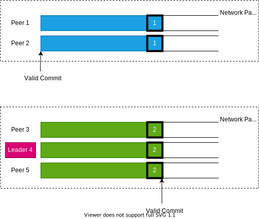
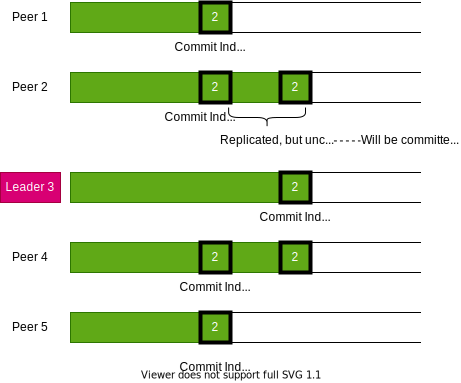
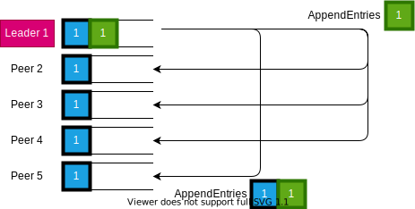

# Foreword

This doc records the bugs I encountered during the labs and the countermeasures I took to address them.

# Overwrite The Committed Logs

The bug **occurred** in **Lab 2B: Log Replication**.

The **commit hash** is `100b478d952b7d2c4cf15c2e14b031254003c64c`

## Bug Description

### Execution Scenario

1. Initially, peer 1 was the leader. Then it received a command. At some moment, it successfully replicated the command on peer 2.
   
   
   
2. Now a network partition happened. 
   
   
   
3. But now, the leader(1) has NOT realized it and still regards itself as the leader. Now 50 new commands come. The leader faithfully appended the new commands to its log and sent heartbeats to all followers to replicate these new logs.
   

  

4. Peers 3, 4, and 5 realized the network partition because their election timer was set off. They elected peer 4 as the leader. When the leader election finished, the leader(4) received another 50 new commands and replicated them on the other two peers(3 and 5). Thus, these commands should be committed.
   
   

5. Now the network is restored. Since the peers in the previous *network partition 1* detected no leader and none of them will be the leader, they must have kicked off many rounds of elections, and their `currentTerm`s are much bigger than 2. *(In the following figure, I assume their terms are both 5)*
   
   

6. The leader(4) realized that there were newer terms, so it stepped down to a follower and waited for election. **Unfortunately, peer 1 got elected, which violates the election restriction**. *As a result, the COMMITTED log(the green part) was overwritten by the uncommitted log(blue region).*
   
   

### The code causing the bug

When implementing the election restriction, my code is

```go
    // If the candidate's log is at least as up-to-date as my log, grant the vote
    // 1. The candidate's last log term is later(more up-to-date)
		if rf.log[len(rf.log)-1].Term < args.LastLogTerm {
			// approve the vote
			rf.logger.Println("Grant. The candidate's term is later")
			rf.voteFor = args.CandidateID
			reply.VoteGranted = true
			return
		}
		// 2. The candidate's term is the same as mine, but the candidate's log is longer
		if len(rf.log) <= args.LastLogIndex+1 {
			// approve the vote
			rf.logger.Println("Grant. The candidate's log is longer")
			rf.voteFor = args.CandidateID
			reply.VoteGranted = true
			return
		}
```

__Therefore, peer 1 WILL get elected in *step 6*.__

## My Solution: Use the `commitIndex` instead of `LastLogIndex`

**The solution was applied at the commit `11e22cc0eb78748873e31b39630e7b252f6718b4`**

From [the evolvement of the steps](#execution-scenario), we can see that peer 1 should NOT be elected as the leader because it has many uncommitted logs. To detect such a state, I decided to use the `commitIndex` in `RequestVoteArgs`. The follower should refuse those candidates who committed less than the follower itself.

**After the commit, All tests of lab 2B PASS.** I ran the tests 500 times WITHOUT FAILURE.

*However, this amendment is not correct. The future lab 2C reveals its weakness.*

# Premature Commit

## Bug Description

The bug **occurred** in **Lab 2C: Persistence**.

The **commit hash** is `11e22cc0eb78748873e31b39630e7b252f6718b4`

### Execution Scenario

The following example can illustrate the problem of using the committed index:

1. Initially, the leader is 3, and the system works fine.
   
   

2. Now the leader(3) received some commands. It adds them into its log and tries to replicate them to its followers by periodic heartbeat. When the system is at the following state, assume the leader(3) crashes.

   

3. Now peer 1 got elected, and received more new commands:

   

**NOTE** that *peer 3 has already committed different commands*, which conflicts with peer 1's committed log.

### Analysis

The bug was introduced by [my solution to address the overwriting log problem in lab 2B](#my-solution-use-the-commitindex-instead-of-lastlogindex).

The source of the problem is that the peer with shorter logs is possible to be a leader because it may have *the same `commitIndex`* as other peers(such as peers 2 and 3) in *step 2*. However, this shouldn't happen.

To fix it, we should return to the paper's suggestions.

## My Solution: Still Use the `LastLogIndex`, But Amend Previous Code

In [the previous code](#the-code-causing-the-bug), the logic between `if` clauses are not consistent. I should check the `args.LastLogTerm` is NOT SMALLER before checking the update-ness.

```go
    // If the candidate's log is at least as up-to-date as my log, grant the vote

    // First ensure that the last log term is NOT SMALLER
    if rf.log[len(rf.log)-1].Term > args.LastLogTerm {
      reply.VoteGranted = false
      return
    }

    // 1. The candidate's last log term is later(more up-to-date)
    if rf.log[len(rf.log)-1].Term < args.LastLogTerm {
    	// approve the vote
    	rf.logger.Println("Grant. The candidate's term is later")
    	rf.voteFor = args.CandidateID
    	reply.VoteGranted = true
    	return
    }
    // 2. The candidate's term is the same as mine, but the candidate's log is longer
    if len(rf.log) <= args.LastLogIndex+1 {
        // approve the vote
        rf.logger.Println("Grant. The candidate's log is longer")
        rf.voteFor = args.CandidateID
        reply.VoteGranted = true
        return
    }
```

**The solution was applied at the commit `d0bbb29a62926b80dbdeb2c5e06ae7f7b63ad800`**

# Re-append Log Entries

## Bug Description

The bug **occurred** in **Lab 2C: Persistence, Under an unstable network**.

The **commit hash** is `d0bbb29a62926b80dbdeb2c5e06ae7f7b63ad800`

### Execution Scenario

1. Initial state, peer 1 is the leader. It receives some commands and tries replicating them on followers by heartbeat.
   
   

2. The followers respond to the heartbeat with `OK` but do NOT reach the leader because of *the unstable network*.
   
   

3. Before the next round of heartbeat, the leader received another new command. But it will repeat the last heartbeat to follower 5 while sending the new command to other followers.

    

4. Because there's no check against duplicated logs, peer 5 will *blindly append the entry*.

   

   Now the leader *thinks* that at index 2, follower 5 holds the green command, but *actually,* follower 5 holds **a duplicated blue command**. Worse, the follower 5 COMMIT the blue command at index 2, causing inconsistent committed logs.

### The Problematic Code

In the `AppendEntries()` method, I used the following code to operate on logs:

```go
	if args.Entries != nil &&
		len(rf.log) > args.PrevLogIndex+1 && rf.log[args.PrevLogIndex+1] != args.Entries[0] {
		// The existing entry conflicts with a new one, delete the existing entry and all that follow it
		rf.log = rf.log[0 : args.PrevLogIndex+1]
	}

	// append any new entries
	rf.log = append(rf.log, args.Entries...)
```

## My Solution

Simply make the concatenation unconditionally preceding `append`:

```go
	rf.log = rf.log[0 : args.PrevLogIndex+1]
	// append any new entries
	rf.log = append(rf.log, args.Entries...)
```

# Re-elected Old Leader Rewrites Committed Log

## Bug Description

### Execution Scenario

1. Initially, peer 1 gets elected as the leader. After it sends `AppendEntries` to other followers, it **CRASHES**. Even worse, the `AppendEntries` were only captured by peer 5 due to the unstable network.
   
   

2. Now peer 3 is elected and immediately receives a command. Its heartbeats are NOT received by ANY peers, and it crashes.

   

3. Now the old leader 1 was restored and elected. It continues to back up its logs and successfully replicate them on the majority. However, immediately after it advances the `commitIndex`, it crashes again. 
   
   

4. Now peer 3 restores and is elected again. It tries to replicate a different log(the green block) on other servers. It succeeds with it and advances its `commitIndex`. Now the disparity appears.

   

### Analysis

*Figure 8* in the Raft paper already pointed out this problem. In the paper, the solution is that *a leader NEVER commits log entries from previous terms by counting replicas.* 

However, this solution is **NOT desirable**. The leader cannot replicate its uncommitted log until it receives a command from clients. The following figure illustrates this:


## My Solution: Append Log Upon Election

Upon election, the leader should append a command to its log and replicate it to prevent stale followers from being elected. The following figure illustrates my solution:


### New Problem Raised From My Solution

**After adopting this mechanism, test 2B all failed.**

[This guy](https://github.com/OneSizeFitsQuorum/MIT6.824-2021/blob/master/docs/lab2.md#%E9%97%AE%E9%A2%98-2%E6%9C%89%E5%85%B3-liveness) tried to use the same approach as mine to address the issue of [the original solution](#analysis-1). And he also encountered the problem here.

#### The Reason

**We have to think about it from the perspective of the upper service.**

The committed log will be sent through `applyCh` and captured by the upper service. I'm sure that most people will write the `apply`ing code like this:

```go
// The definition of ApplyMsg
type ApplyMsg struct {
	CommandValid bool
	Command      interface{}
	CommandIndex int

	// For 2D:
	SnapshotValid bool
	Snapshot      []byte
	SnapshotTerm  int
	SnapshotIndex int
}

// The thread applying committed logs
func (rf *Raft) applier() {
	for !rf.killed() {
		rf.commitIndexUpdate.L.Lock()
		// wait until there's some unapplied commit (lastApply < commitIndex)
		for rf.lastApplied >= rf.commitIndex {
			rf.commitIndexUpdate.Wait()
		}
		toApply := rf.log[rf.lastApplied+1 : rf.commitIndex+1]
		applied := rf.commitIndex
		rf.commitIndexUpdate.L.Unlock()

		for i, log := range toApply {
        rf.applyCh <- ApplyMsg{true, log.Command, rf.lastApplied+i+1, false, nil, 0, 0}
		}
    // Until 2B, rf.lastApplied was ONLY accessed in this single thread,
    // And it is guaranteed that `applied` > `rf.lastApplied`.
    // So it is safe to operate it without rf.mu
		rf.lastApplied = applied
	}
}
```

**However**, the upper service will **get the empty commands** appended by the leader election, which is **NOT expected, even not valid**! 

**Besides**, the empty logs will occupy indexes, making the commands issued by the clients **not sequential**. The following figure demonstrates this:


**NOTE** that you *CANNOT* simply skip these empty commands due to **index disparity**!

#### My Approach: Two Indexing Systems

The idea is that I can attach a sequentially increasing index to the `LogEntry` in the Raft and use the index to fill in the `ApplyMsg`. So my `LogEntry` should be defined as:

```go
type LogEntry struct {
	Term    int
	Command interface{}
	// the valid command index(ignore the leader's dummy command upon election)
	Index int
}
```

I call the `Index` **service index** because it is the index exposed to the upper service, and I call the index of `[]LogEntry` **internal index** because it is the index operating between Raft peers. The following picture shows the concepts of **service index** and **internal index**.


After some adjustments to the code, I *successfully passed all tests*.

# Timeouts

## Bug Description

After I finished Part C, under rare cases *(about every 400 rounds of tests)*, `Test 2A` will fail since it cannot check one leader within 5 seconds; `Test 2C: Figure 8(Unreliable)` will fail because it cannot reach an agreement within 10 seconds.

## Reasons & Solutions

There're various reasons why the situation happened. 

### Flaws In Election Procedure

Initially, the period of election is different in every round. 

A typical election procedure is:

1. The election timer goes off;
2. Sleep for a random time in [200, 500] ms;
3. Increase the current term, vote for myself, parallelly send vote request to all peers;
4. Wait for results, or terminate the election if there's no result within 400ms;
5. If there's no leader, start the next round of elections.

If a peer falls behind too much, its vote requests will never be granted by any peers. However, the vote requests sent by this peer can update other peers' `currentTerm,` thus stopping any ongoing election. If it's lucky enough, it can send new vote requests as soon as 300ms, and heavily disrupt the elections.

**To solve it**, I can add some time after an election ends so that one round of election always takes 1 second.

### Flaws In Heartbeat

1. When a leader converts to a follower due to an emerging new term, I forgot to reset `voteFor`. In this case, if the leader(now a follower) receives a vote request of the same round, it will refuse because it *thinks* it has voted for someone, thus wasting the time of one round election.

   **To solve it**, just reset the `voteFor` every time a new term is detected.

2. A leader may wrongly convert to a follower because the `leaderID` can be easily reset. Consider the following scenario:

   

   The leader shouldn't step down in term 2. But it did, thus wasting more time and failing the test due to timeout.

   **To solve it**, always reset the `leaderID` just before exit the leader thread.

   **Note:** This modification should be applied carefully, because there's a time gap between `leaderID` change and the state change. The `leader()` thread wakes up every 100ms, and the change of the state happens during the sleep. If the upper service wants to send command just after the state change, the `leaderID` has NOT been reset, and the Raft still *thinks* that it's the leader, and it will append commands to its log, but with a newer term, which is a fatal error.

# Afterword

In fact, I fixed much more bugs than mentioned above. If you have interest, you can see [my commit histroy](../src_commit_log.txt).
